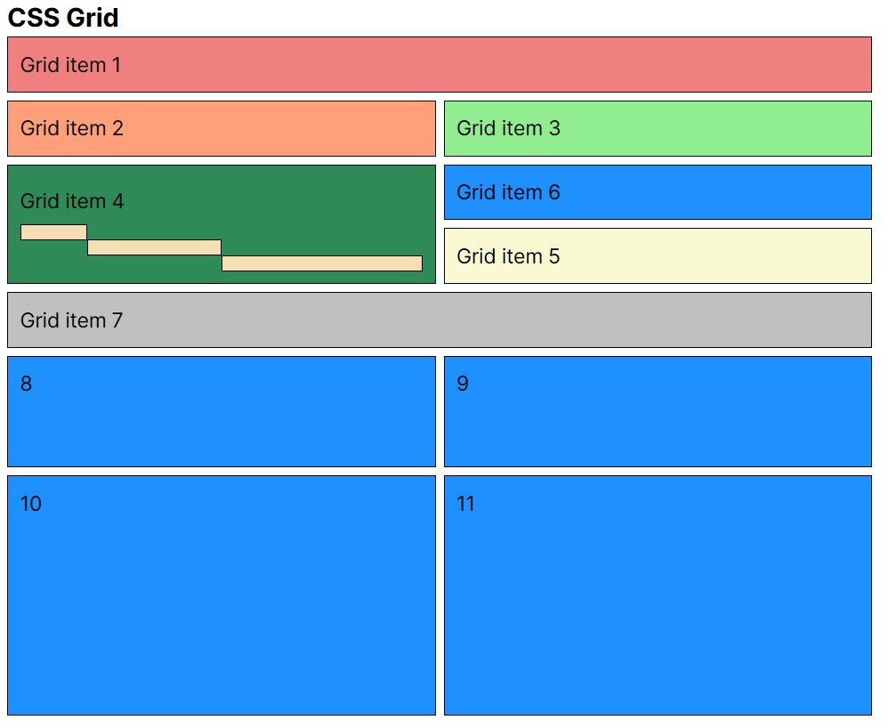

# CSS Grid

---

## Demo

[Click here to see the demo](https://stefanoturcarelli.github.io/grid/)

# Basic Properties

Properties for the Parent (Grid Container)

- `display: grid;`: Defines the element as a grid container.
- `grid-template-columns`: Defines the columns of the grid with a space-separated list of values.
- `grid-template-rows`: Defines the rows of the grid with a space-separated list of values.
- `grid-auto-columns`: Specifies the size of any auto-generated grid columns.
- `grid-auto-rows`: Specifies the size of any auto-generated grid rows.
- `gap`: A shorthand for row-gap and column-gap. Specifies the size of the grid lines (space between the columns/rows).
- `grid-template-area`: Defines a grid template by referencing the names of the grid areas which are specified with the grid-area property.

Properties for the Children (Grid Items)

- `grid-area`: Gives an item a name so that it can be referenced by a template created with the `grid-template-areas` property.

# CSS Grid properties

---

The CSS Grid categorizes properties into those that apply to the grid container (parent) and those that apply to the grid items (children)

- Parent -> Grid Container
- Children -> Grid Items

To create a layout using CSS Grid, define a container element (parent) and apply the `display: grid;` property.

## Properties for the Parent (Grid Container)

- `display`
- `grid-template-columns`
- `grid-template-rows`
- `grid-template-areas`
- `grid-template`
- `grid-column-gap`
- `grid-row-gap`
- `grid-gap`
- `justify-items`
- `align-items`
- `place-items`
- `justify-content`
- `align-content`
- `place-content`
- `grid-auto-columns`
- `grid-auto-rows`
- `grid-auto-flow`
- `grid`

## Properties for the Children (Grid Items)

- `grid-column-start`
- `grid-column-end`
- `grid-row-start`
- `grid-row-end`
- `grid-column`
- `grid-row`
- `grid-area`
- `justify-self`
- `align-self`
- `place-self`

# References

---

- [A Complete Guide to CSS Grid by CSS-Tricks](https://css-tricks.com/snippets/css/complete-guide-grid/#aa-grid-properties)
