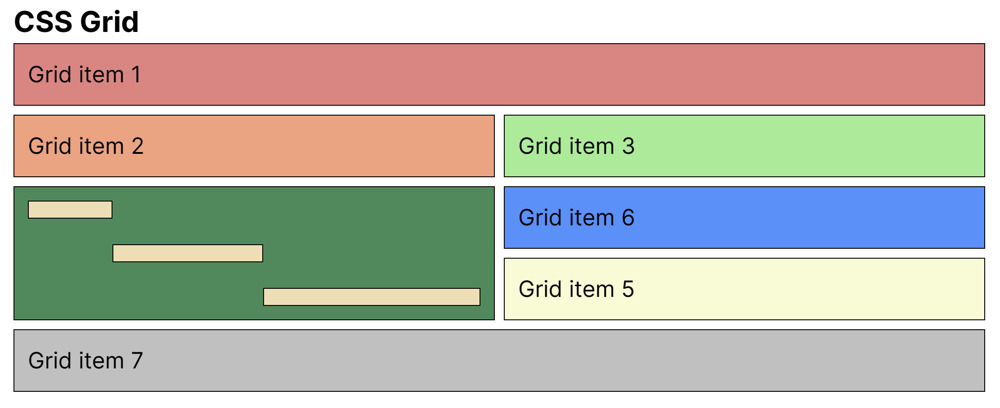

# CSS Grid

---

## Demo

[Click here to see the demo](https://stefanoturcarelli.github.io/grid/)

## Basic Properties

---

### Parent properties

`display: grid;`
`grid-template-columns`
`grid-template-rows`
`grid-auto-rows`
`gap`

## Template Areas

---

### Parent

`grid-template-area:`

### Children

`grid-area`
